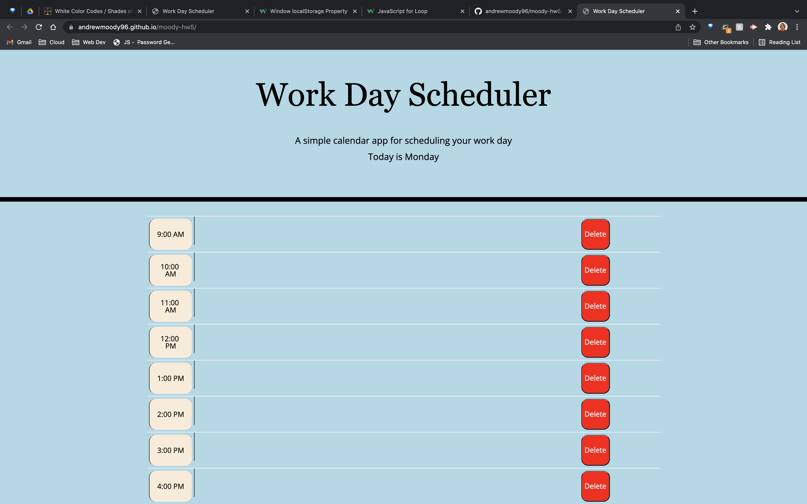
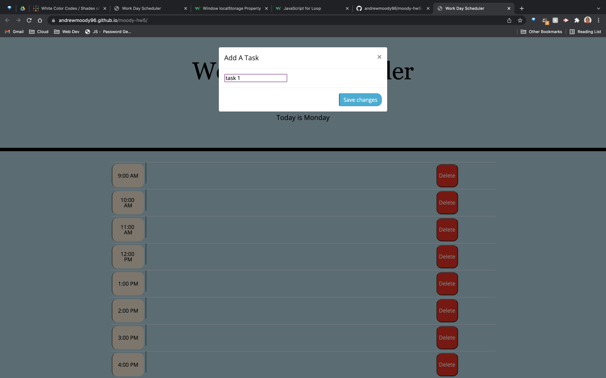

# Moody-HW5: Work Day Scheduler

## Description

This app allows users to add tasks to timeslots throughout normal work hours. For the sake of this project, it is assumed that work begins at 9 AM and ends at 5 PM. Users are also able to delete these tasks.
 
 
Users can expect to maintain their saved tasks upon reloading the page through use of local storage.
 
 
The application uses color coding to determine if a timeslot is in the past, present, or future. 
 
 

## Accessing the Application
GitHub Pages:
 
https://andrewmoody96.github.io/moody-hw5/
 
 
Repo:
 
https://github.com/andrewmoody96/moody-hw5
 
 

## Issues
STILL PLAYING CATCHUP...
 
This means missing functionality. I will continue to update and resubmit the application as soon as I am able.
 
 

## Screenshots

 

 

